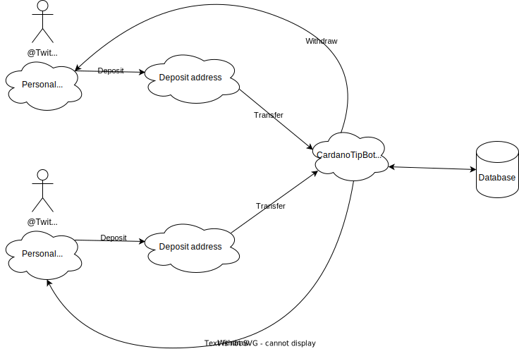

# cardano-tip-bot
Use [@CardanoTipBot](https://twitter.com/CardanoTipBot) to tip ADA &amp; tokens with Twitter!

## Disclamer
This software is provided to promote engagement in the Twitter [#cardano](https://twitter.com/search?q=%23Cardano) community in a fun way. It is not (and should not be) used to store ADA or other native assets of the Cardano blockchain. We are not responsible of lost funds or incorrect balances. Use at your own risks!

## Limitations / Processing delays
This bot uses the Twitter API which has some limits. For example, direct messages can only be queried once per 60 seconds so it can take a little while before receiving an answer.

When handling deposits/withdrawals, the bot transfers to/from the master wallet and waits for a certain amount of blocks before updating your balance. This is to make sure your deposit/withdrawal isn't rollbacked by a chain fork.

## Supported assets
1. ada (6 decimals: `0.000000`) 1 ada = 1000000 lovelace
2. lovelace (0 decimal) 1 lovelace = 0.000001 ada
3. HOSKY (`2aa9c1557fcf8e7caa049fa0911a8724a1cdaf8037fe0b431c6ac664.50494759546f6b656e`) (0 decimal)

Any decimals beyond what's declared above will be discarded. For example `1.23456789 ada` is automatically converted to `1.234567 ada` (ie `1234567 lovelace`).

## Fees
1. Deposit fee: 0.1 developer ada + network transaction fee (about 0.18-0.20 ada)
2. Withdrawal fee: 0.1 developer ada + network transaction fee (about 0.18-0.20 ada)
3. Tip: Free!

## How it works

Each Twitter user gets assigned its own, unique deposit address. The user sends $ada & supported assets to its address to funds its balance. CardanoTipBot will move these funds to a central wallet and update the user's balance in the internal database. The user can now tip other users. The user can also withdraw its $ada & assets at any time.



## How to use
### Direct messages
You can send a direct message to [@CardanoTipBot](https://twitter.com/CardanoTipBot) to create and view information about your wallet:

1. `!info` will return the following message:

    ``` 
    USE AT YOUR OWN RISKS!
    WE ARE NOT RESPONSIBLE OF LOST FUNDS!
    
    Please refer to the user guide in my profile's description for how to use me.

    Your balance is:
    7.952868 ADA
    2000000 HOSKY

    Your deposit address is: addr1qxxxxxxxxxxxxxxxxxxxxxxxxxxxxxxxxxxxxxxxxxxxxxxxxxxx
    
    Your deposit address will be monitored for the next 24 hours. You will need to message me again to restart the monitoring.
    You will receive a message when a deposit is processed.

    Only deposit supported assets*:
    - HOSKY (2aa9c1557fcf8e7caa049fa0911a8724a1cdaf8037fe0b431c6ac664.50494759546f6b656e)

    Minimum withdrawal amount: 2.0 ADA
    Deposit fee**: 0.1 ADA
    Withdrawal fee**: 0.1 ADA

    Available commands:
    !info
    !withdraw <address> <amount> <asset>

    * Any deposit containing an unsupported asset will be returned MANUALLY, minus deposit fee**

    ** Plus an extra TX fee of about 0.2 ADA to move to/from master wallet
    ``` 
    
2. `!withdraw <address> <amount> <asset>` will allow you to send the `<amount> <asset>` to an `<address>` where:

    - `address` is a shelley address you own **that is not an exchange**
    - `amount` is the amount you want to withdraw
    - `asset` is the asset you want to withdraw
    
    Multiple amount and assets can be specified in the following format `amount asset[, amount asset[,...]]`. Valid examples:
    
    - `3 ada`
    - `1000 lovelace`
    - `3 ada, 1000000 hosky`
    - `1000000 hosky`
    
    The complete command could look like `!withdraw addr1qxxxxxxxxxxxxxxxxxxxxxxxxxxxxxxxxxxxxxxxxxxxxxxxxxxx 3 ada, 1000000 hosky`

### Tweets
You can tip someone by replying to one of their tweet: `@CardanoTipBot !tip <amount> <asset> [message]` where:

- `amount` is the amount you want to tip
- `asset` is the asset you want to tip
- `message` is arbitrary text

Multiple amount and assets can be specified in the following format `amount asset[, amount asset[,...]]`. Valid examples:

- `3 ada`
- `1000 lovelace`
- `3 ada, 1000000 hosky`
- `1000000 hosky`
    
The complete command could look like `@CardanoTipBot !tip 3 ada, 1000000 hosky wow great work, thank you!`

## Roadmap
### Phase 1
- Twitter integration
    - Deposit assets
    - Tip other users
    - Withdraw assets

### Phase 2
- [$handle](https://adahandle.com/) integration for withdraw
- Discord integration
    - Deposit assets
    - Tip other users
    - Withdraw assets

### Phase 3
- More Discord integration (surprises 😉)

### TBD
- Hydra integration
    - Remove central database
    - Tipping is done on-chain
    - Allow user to retrieve their private keys (seed)

## FAQ

TODO

## Like the bot? Support us!
If you like bot and would like to support us, you can:
1) Tip the bot on Twitter (reply `@CardanoTipBot !tip 1 ada` to a tweet by @CardanoTipBot)
2) Stake some ADA with [QCPOL](https://pool.pm/c2b8bff5160dd75149f2cae0955698550e8cf0d390025b26a9508a3e)
